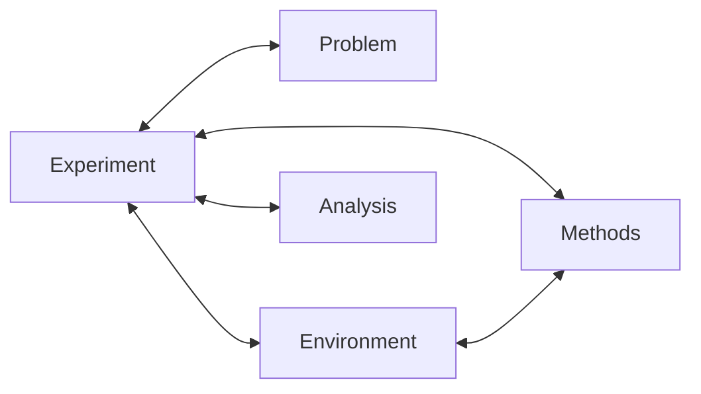

# Road restoration research code

`main.py` runs the finalized daily problem implemented in `src/problem/daily.py`.
The detailed research logic map is kept locally under `doc/notes/`; the GitHub
repository contains only `src/`, `data/`, `main.py`, this README, and
`requirements.txt` (plus `.gitignore`). Unsupported historical methods fail
before an experiment starts.

Install the direct dependencies with `python -m pip install -r requirements.txt`
(Python 3.14.5). The optional independent traffic-solver audit also needs
AequilibraE; production experiments do not.

## Current problem

- Integer days, one nonpreemptive crew, no crew-accessibility constraint and no
  voluntary waiting when an eligible road is available.
- Damage scales 6, 11, 17 and 23. Normal two-way traffic defines high/middle/low
  bins of 8/21/9 roads. Low-flow roads are excluded. The approved per-scale quotas
  split damage into shared initially public roads and scenario-specific hidden roads.
- Estimated severities have probabilities 25%/50%/25%. True severity is conditional
  on the estimate, with 60% on the diagonal. Hidden roads are discovered on days 1–14.
- Rule (4)'s exact mean/standard-deviation table defines lognormal durations,
  upper-truncated at 2.5 times the target mean and rounded half up to at least one day.
  A public duration estimate rounds the expectation of this actual integer
  distribution for the public road class and estimated severity. True duration
  is sampled using true severity. These are not interchangeable.
- Natural demand reaches 100% on day 35. The complete environment includes the
  approved seven-day response. Day 35 is not a deadline.
- Each day contributes 50% normalized travel-time loss and 50% per-OD flow loss.
  Disconnected trips have zero actual flow and no artificial time-loss penalty.
  Losses accumulate without dividing by a fixed horizon or recovery duration.
- Evaluation ends only after all repairs finish and every positive-demand OD
  reaches 99% of normal flow, with demand-weighted time at most 101% of normal,
  for two consecutive days. Scenario objectives are averaged with equal weights.

The current rule version is `daily_discovery_v3`. Changing rules, duration
parameters or scenario truth changes the experiment identity. Historical samples,
models and results are not overwritten or reused as results of the new setting.

## Running and checking

```powershell
python main.py --n 11 --solve rl_s2v_saa64_adaptive --training-behavior both
python main.py --n 11 --solve ga
python main.py --n 11 --solve compare
```

GA and RL share 64 training, 11 validation and 50 test scenarios. GA scores each
single fixed-priority policy on all 64 training scenarios in the complete
environment; test scenarios never enter its search. At execution it selects the
highest-priority currently discovered, unrepaired road.

For RL, `--training-behavior natural` is the explicit training ablation;
`response7d` is the default complete training environment, and `both` runs both.
Each model validates under its own training assumptions. Both final policies are
tested under the complete seven-day-response environment. Road class is included
by default in both variants (17 road inputs and six global inputs);
`--no-road-class-input` explicitly requests the 14-column ablation.
The S2V architecture, learning algorithm, hyperparameters and stopping rules are
unchanged by the problem-definition update.

`--workers 4` controls parallel simulation. The training/search seed does not
change the common scenario seed. Either GA or RL can initialize the same frozen
problem dataset; later methods verify it instead of rewriting it. Checkpoints
resume only with compatible source and settings. Each run saves a source archive.

## Five modules and their interfaces



| Responsibility | Current implementation | Data exchanged |
|---|---|---|
| Problem definition | `src/problem/daily.py` | Public network/reference data; complete scenarios and timed public revelations. |
| Repair and traffic environment | `src/environment/daily.py` | Public observations; legal actions; interval rewards; daily losses and recovery termination. |
| Decision methods | `src/methods/daily_s2v.py`, `daily_ga.py` | Trained policy or fixed priority; selected eligible road. |
| Experiment execution | `main.py`, `src/experiment/daily.py`, `daily_ga.py` | Frozen samples, source/settings identities, run orchestration and records. |
| Analysis and visualization | `src/analysis/daily.py`, `src/analysis/viz/` | Verified paired results, computation times and figures. |

Complete severity, duration and discovery truth stays inside the environment.
An observation contains discovered roads and their public estimates, current OD
flows/times and directional road flows/times. Closed links are observed with zero
flow and infinite travel time; hidden damage identities and future discoveries
are not supplied as labels. RL continues to use its existing feature encoder.

Rewards are negative cumulative loss between decisions. The final action also
receives the subsequent traffic-recovery losses. With the approved initial public
roads, total episode reward is the negative scenario objective.

## Output layout

```text
outputs/
  experiments/
    n11_discovery_response7d_1day_lhs50_s42_<fingerprint>/
      performance_distribution.png
      method_figures/
      data/
        manifest.json
        problem/
        scenarios/{train,validation,test}.json
        methods/<method>_seed<seed>/
          config/  results/  log/
        analysis/{results,config}/
        evaluation.csv
        gallery_index.json
  studies/
    problem_setting/
    traffic_solver/
    human_behavior/
```

Figures are visible at the experiment level; raw tables, models, configurations
and logs stay under `data/`. Existing historical experiment folders retain their
own settings and evidence and are not relabeled as the current problem.

## Historical code

Local historical archives under `legacy/` and prior experiment outputs are not
published in this GitHub repository. Completed historical runs kept locally
carry their original `config/source_snapshot.zip`.

Old problem samplers and experiment runners now reject execution explicitly.
Some historical modules remain under `src/` because current methods reuse their
S2V network, genetic operators or traffic utilities. These shared helpers are not
a second active problem setting. Older analysis/study code is retained for
reference; it is not a production experiment route. Earlier migration backups
under `.legacy/` are untouched.
